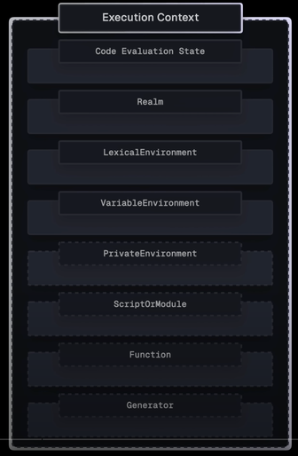
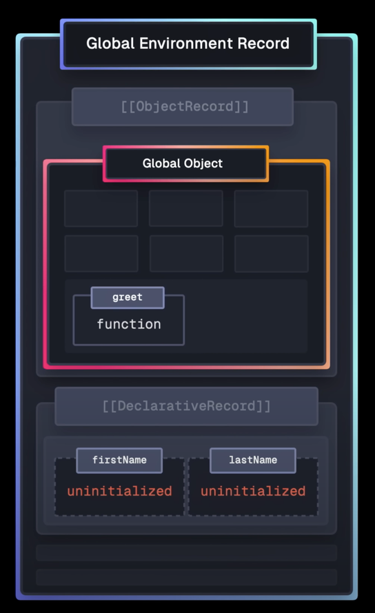

# Execution Contexts in JavaScript

[original video](https://www.youtube.com/watch?v=zdGfo6I1yrA)

- JavaScript is a single-threaded language, which means it can only execute one piece of code at a time. To manage this, JavaScript uses an execution context to keep track of the current state of the program.

These contexts are managed by the JavaScript engine using a _stack_, often referred to as the `execution stack` or `call stack`.
**An execution context is, in simplistic terms, a concept that describes the environment in which JavaScript code is executed. Code is always executed within a context.**

In JavaScript, there are primarily **4 types** of _execution context_:

1. **Global Execution Context**
2. **Function Execution Context**
3. **Eval Execution Context**
4. **Module Execution Context**

Brief explanation:

- **Global Execution Context**:

  - This is the default or base execution context.
  - It's created when the JavaScript script first starts to run.
  - There can only be one global execution context in a program.

- **Function Execution Context**:

  - Created whenever a function is called.
  - Each function has its own execution context.

- **Eval Execution Context**:

  - Created when code is executed inside an `eval()` function.

- **Module Execution Context**:
  - Created for the top-level code of a module.
  - Similar to the global context, but specific to the module.
  - Introduced in ES6 modules

The _`Global Execution Context`_ is at the bottom of this stack and new _`Function Execution Contexts`_ are _pushed_ onto the stack as functions are called, and _popped off_ when they return. This _stack-based_ mechanism allows JavaScript to manage the flow of code execution efficiently.

> _Some important definitions:_
>
> 1. **Variable Environment**: It stores all the variables and functions that are currently in scope.
> 2. **Lexical Environment**: It refers to the lexical structure of the code, which includes the location of the code within the source file.
> 3. **Scope Chain**: It is a reference to the variable environment of the parent execution context.
> 4. **This Keyword**: It refers to the object that the function is called on
> 5. **Call Stack**: It is a stack data structure that keeps track of the execution contexts as they are created and destroyed
> 6. **Global Execution Context**: It is the outermost execution context, which is created when the JavaScript engine starts executing the code. It contains the global variables and functions.
> 7. **Function Execution Context**: It is created whenever a function is called. It contains the parameters passed to the function and the local variables declared inside the function.
> 8. **Eval Execution Context**: It is created by the `eval()` function, which allows you to execute JavaScript code as a string
> 9. **Module Execution Context**: It is created when a module is imported using the `import` statement. It contains the exported functions and variables from the module.

---



- When a function is invoked, a new `execution context` is created and pushed onto the call stack, which is actually just an _`execution context stack`_.
- Execution context essentially defines the _environment_ in which our code is executed, and it contains many internal components that the engine uses to keep track of the _`execution flow`_ of that piece of code.
- And execution context uses `Environment Records` to keep track and maintain the `Identifier bindings` that have been created for the _variable declarations_, _function declarations_, all the values within that context.

  

Let's use this script as an example and see what happens behind the scenes whenever we run this script.

```typescript
const firstName = 'Lydia';
let lastName = 'Hallie';

function greet(nameToGreet) {
  const fullName = nameToGreet + ' ' + lastName;
  return 'Hello, ' + fullName;
}

greet(firstName);
```

## Global Execution Context

So first, as the script is loaded, the _`Global Execution Context`_ is created and every _execution context_ goes through **2 phases**.

### Creation Phase

- 1st, we have the **`creation phase`** in which memory space is set up for the _variable declarations_, _function declarations_, and so on within that context.

  

### Execution Phase

- 2nd, we have the **`execution phase`** in which the _execution context_ is on the _call stack_ and the code is actually executed.

  

The _`Global Execution Context`_ has many components, but for now, lets focus on the `Realm`, the `Lexical Environment`, and also the `Variable Environment` just to make it complete.

### Realm

- The `Realm` points to a _Realm record_, and a _Realm_ is essentially an **isolated environment** in which our code runs. So, for example, in browsers, a new _Realm_ is created whenever we open a _new tab_, we _refresh a page_, for _service workers_, _web workers_, _iFrames_, and so on. So it's essentially just the _isolated environment_.

  

And a `Realm` consists of several components, including the `Intrinsics`, the `Global Object`, and the `Global Environment Record`.

#### Intrinsics

The **`Intrinsics`** provide all the standard built-in _`objects`_ and _`functions`_ that are essentially just foundational for executing **JavaScript**, so like _`Array`_, _`Function`_, _`Syntax Error`_, and so on.

#### Global Object

Then we have the **`Global Object`**, which contains several types of properties:

- So first, we have the **`Specification defined properties`** (_**JavaScript functionality**_), which essentially just expose the _`Intrinsics`_. So _`Array`_ _`Function`_, all the JavaScript stuff is on the _Global Object_.
- And then we have the **`Host defined properties`** (_**Browser APIs**_), which in a browser are things like `fetch`, `setTimeout`, `Document`. That's also all made available through the _Global object_.
- And last but not least, we have the **`User defined properties`**. So as developers, we can either explicitly add properties to the _Global Object_ or we do it implicitly whenever we declare a _`function`_ in the global scope or whenever we have a variable with a _`var`_ keyword in the global scope. These are also added to the _Global Object_ and are now available, ready to use throughout the entire script.

#### Environment Record (Global Environment Record)

And lastly, we have the **`Global Environment Record`**.

- And, again, `Environment Records` manage the _`Identifier bindings`_ within that context. So in the case of the _Global Environment Record_, these values are accessible throughout our entire script.

> **Identifier Bindings**
>
> By _"Identifier"_ here we mean the name of a variable or function, and by _"variable"_ we mean a _reference_ to a specific object (including a function) or a _primitive value_.

##### ObjectRecord

- And the _Global Environment Record_ again contains another `ObjectRecord`. So the _ObjectRecord_ is essentially just a **direct reference** to the _Global Object_ in this case.
- So this is used by variables with the _`var`_ keyword and _`function declarations`_ on the global scope.
  

##### DeclarativeRecord

- It also contains a `DeclarativeRecord` and this stores all _Identifier bindings_ declared with `let`, `const`, also `classes`.
  - Note that in a **`Function Execution Context`**, it, in addition, contains function `parameters` an `arguments` object that stores correspondences between indices and values of arguments passed to the function and information about the number of such arguments.
    

##### GlobalThisValue

- And _environment records_ also contain the value of the `this` keyword, which in the case of the _Global Environment Record_ is the global `this` value. And in most cases, `this` just points to the _Global Object_.

##### OuterEnv Reference

- And finally, it also has an `OuterEnv` or `OuterEnvironment` property. And in the case of the _Global Environment Record_, this is **null**.
- But later, we will see why this is a very important property when we talk about _`scope`_, _`scope chain`_, and so on.

### Lexical Environment Record

And the `Lexical Environment` just points to the _environment record_ that contains the bindings for variables declared with `let`, `const`, `classes` etc. So in this case, that is the _Global Environment Record_.

### Variable Environment Record

And then we have the `Variable Environment`, and this points to the environment record that stores the bindings for the variables declared with the _`var` keyword_ and _`function declarations`_, which in this case also is the _Global Environment Record_.

## Script walk-through

So, finally, let's take a look at our script.

```typescript
const firstName = 'Lydia';
let lastName = 'Hallie';

function greet(nameToGreet) {
  const fullName = nameToGreet + ' ' + lastName;
  return 'Hello, ' + fullName;
}

greet(firstName);
```

### Creation phase

- So when parsing this code in the **creation phase**, it first encounters the variable `firstName`, and this is declared with the `const` keyword. So it uses the execution context **`Lexical Environment`**, and this in turn points to the _Global Environment Record_.

- And this again uses the **`DeclarativeRecord`** to handle the _identifier bindings_ created with the `const` keyword.

  

  > And something and special about variables created with the `const` and `let` keyword, and also `classes`, is that they are _uninitialized_.
  > Meaning that memory space is set up, they're **hoisted**, but they don't have a value yet. They are _uninitialized_. They're only initialized during the **execution phase** of the _execution context_.

- So then on line 2, pretty similar. We have the `lastName` variable, and this time, we use the `let` keyword. So it again uses the _**Lexical Environment**_, which points to the _Global Environment Record_, which again uses the _**DeclarativeRecord**_ to store this binding. And similar to `const`, it is uninitialized until the **execution phase**.

- And then we have the _function_ `greet`, and `function declarations` are managed by the **`ObjectRecord`**. And in contrast to the two previous variables, _functions are initialized during the creation phase_.
  
  So a new **`Function Object`** is created for `greet`.
- And _function objects_ contain many properties, two of which are the _`Environment`_, which points to the environment record in which the function was declared. So in this case, the _Global Environment Record_.
  
- And it also has the _`Call`_ method, which gets called whenever we invoke the function.

### Execution phase


- So now the _`Global Execution Context`_ is added to the `call stack` and is executed.
- So, again, on the first line, we have the `firstName` variable. So now this variable gets initialized with the value of the string 'Lydia'. And then on the second line, we have the `lastName` variable. So similar to the first one, it now gets initialized with the string, 'Hallie'.

- And then we have the `greet` _function_, but this is already initialized in memory so nothing gets done here. Then on line 9, we actually invoke this function.
- So the `Call` method on the _Function Object_ is called, and this, in turn, creates a new **`Function Execution Context`**. And you may have guessed, again, this execution context goes through **two phases**. So the _`creation phase`_ and the _`execution phase`_.
  

#### Function Execution Context - Creation Phase

- So, in this case, the _`Lexical Environment`_ contains a brand new _Function Environment Record_, and this manages the _identifier bindings_ for the parameters, variables, and function declarations within this function.

- And it also has an `OuterEnv` property. Again, the _Outer Environment_, which points to the environment of the _`Function Object`_, which, in this case, is the _Global Environment Record_. And unlike the _`Global Execution Context`_, we now have to deal with _function parameters_. So in this case, `nameToGreet`.
  

- And these are immediately added to the _Function Environment Record_, and, also, these are immediately initialized with the value that we pass. So in this case, the string 'Lydia'.
- Next, we declare the `fullName` with the `const` keyword. And this is also added to the _Function Environment Record_, but it is uninitialized until we get to the _`execution phase`_. So now that we've allocated memory for the _parameters_ and the _variables_, it's time for the _`execution phase`_.

#### Function Execution Context - Execution Phase


- So the _`Function Execution Context`_ is added onto the `call stack`. So first, we have the `fullName` variable, and this uses both the `nameToGreet` parameter value, but also the `lastName` variable.
- Now the _Function Environment Record_ itself doesn't have a binding for `lastName`.
- So instead, it uses the `OuterEnv` property on the _Environment Record_ to search through the chain of environments, the _scope chain_, to see if the _`OuterEnv`_ does have the binding for this. So in this case, that is the _Global Environment Record_, and, yes, this one does have `lastName`, which is 'Hallie'.
  

- So now `fullName` is equal to the string 'Lydia Hallie', and then the function returns 'Hello, Lydia Hallie'.
  
  And as it returns, the _`Function Execution Context`_ is removed from the `call stack`. And the topmost _execution context_ is the currently running _execution context_, which is, again, the global one.
- Now there is nothing else to do in our script. So now also the _`Global Execution Context`_ is removed from the `call stack`, which is the end of our script.

## Understanding Variable Hoisting

- Hoisting happens during the _creation phase_ of an _execution context_ and variables declared with `let`, `const`, `classes` and `imports` are _**hoisted**_ to the top of their scope. However, this does not mean they are initialized at this point, rather, a reference to them is created in the _Lexical Environment Record_.

- Imagine the following code:

  ```javascript
  console.log(x); // ReferenceError: x is not defined

  let x = 10;
  ```

In this example, the `x` variable is declared at the end of the script. However, when we try to log its value, a `ReferenceError` is thrown because it has not been initialized yet. They're only initialized during the _execution phase_ when their actual declaration is reached in the code.

### Temporal Dead Zone

- Variables that are declared with `const` or `let` within an inner function are placed in a **temporary dead zone** until they are actually assigned a value. Accessing these variables before their declaration
  will result in a `ReferenceError`.

  `Temporal Dead Zone Example`

  ```javascript
  function outer() {
    console.log(x); // ReferenceError: x is not defined
    const x = 10; // In the temporal dead zone
  }

  outer();
  ```

- In this example, we declare `x` as a constant within an inner function. Because it's in the _`temporal dead zone`_, trying to access its value before assignment will result in a `ReferenceError`.

### Hoisting for var variables

- Then we have variables with the `var` keyword. And during the _creation phase_ of the _execution context_, these are also _hoisted_ and _initialized_, but with the value of `undefined`. And these variables get redefined with their actual values during the _execution phase_ whenever their declaration is reached within the code.

  ```javascript
  console.log(foo); // undefined
  var foo = 'Hello!';
  console.log(foo); // 'Hello!'
  ```

### Function Hoisting

- And lastly, we have `functions`, including `async`, `generator` functions and so on.
  Functions are already initialized during the _creation phase_ with their actual _`Function Object`_. This means that functions can be invoked before their declaration because the function object is already in memory.

  ```javascript
  console.log(add(10, 20)); // 30

  function add(a, b) {
    return a + b;
  }
  ```

In this example, we try to call the `add` function before it's declared. Because functions are hoisted, they become part of the global scope and can be invoked immediately.

## **Closures**

- A `closure` is created when an inner function keeps a reference to the outer function's _Environment Record_. This means that the inner function has access to the variables in the outer function's scope even after the outer function has returned and this is made possible through the _`Function Object's`_ **Environment** property.

- Creating a _closure_ example:

  ```javascript
  const firstName = 'Lydia';

  function outer() {
    const lastName = 'Hallie';

    function inner() {
      const fullName = firstName + ' ' + lastName;
      return fullName;
    }

    return inner;
  }

  const getFullName = outer();
  getFullName(); // Lydia Hallie
  ```

- In this example, when we invoke `getFullName` , a new _`Function Execution Context`_ is created that has a brand new function _Environment Record_. And this function environment record's `OuterEnv` property points to the environment property on the _`Function object`_, which in this case is the `outer` function's _Environment Record_.

  

- So within `inner`, we still have access to the `lastName` variable.
  So it'll traverse the _scope chain_ and `OuterEnv` pointing to the `outer` functions _environment record_, which contains a binding for `lastName`.

  

### Understanding Scope Chain

- The engine traverses the `scope chain` (`OuterEnv` properties) to find a binding for a variable or property not found in the current context's _Lexical Environment Record_.
  

- _Scope chain_ example:

  ```javascript
  const firstName = 'Lydia';

  function outer() {
    const lastName = 'Hallie';

    function inner() {
      const fullName = firstName + ' ' + lastName;
      return fullName;
    }

    return inner();
  }

  outer();
  ```

  In this case, the `firstName` variable is found in the _Global scope_ and the `lastName` variable is found in the `outer` function's _Lexical Environment Record_. The engine uses the _`scope chain`_ to access these variables when executing the `inner` function.
