# Execution Context in JavaScript

[original video](https://www.youtube.com/watch?v=zdGfo6I1yrA)

- JavaScript is a single-threaded language, which means it can only execute one piece of code at a time. To manage this, JavaScript uses an execution context to keep track of the current state of the program.

> _Some important definitions:_
>
> 1. **Variable Environment**: It stores all the variables and functions that are currently in scope.
> 2. **Lexical Environment**: It refers to the lexical structure of the code, which includes the location of the code within the source file.
> 3. **Scope Chain**: It is a reference to the variable environment of the parent execution context.
> 4. **This Keyword**: It refers to the object that the function is called on
> 5. **Call Stack**: It is a stack data structure that keeps track of the execution contexts as they are created and destroyed
> 6. **Global Execution Context**: It is the outermost execution context, which is created when the JavaScript engine starts executing the code.It contains the global variables and functions.
> 7. **Function Execution Context**: It is created whenever a function is called. It contains the parameters passed to the function and the local variables declared inside the function.
> 8. **Eval Execution Context**: It is created by the eval() function, which allows you to execute JavaScript code as a string
> 9. **Module Execution Context**: It is created when a module is imported using the import statement. It contains the exported functions and variables from the module.

---

## Global Execution Context

- When a function is invoked, a new `execution context` is created and pushed onto the call stack, which is actually just an _execution context stack_.
- Execution context essentially defines the environment in which our code is executed, and it contains many internal components that the engine uses to keep track of the _execution flow_ of that piece of code.
- And execution context uses `environment records` to keep track and maintain the `identifier bindings` that have been created for the _variable declarations_, _function declarations_, all the values within that context.

  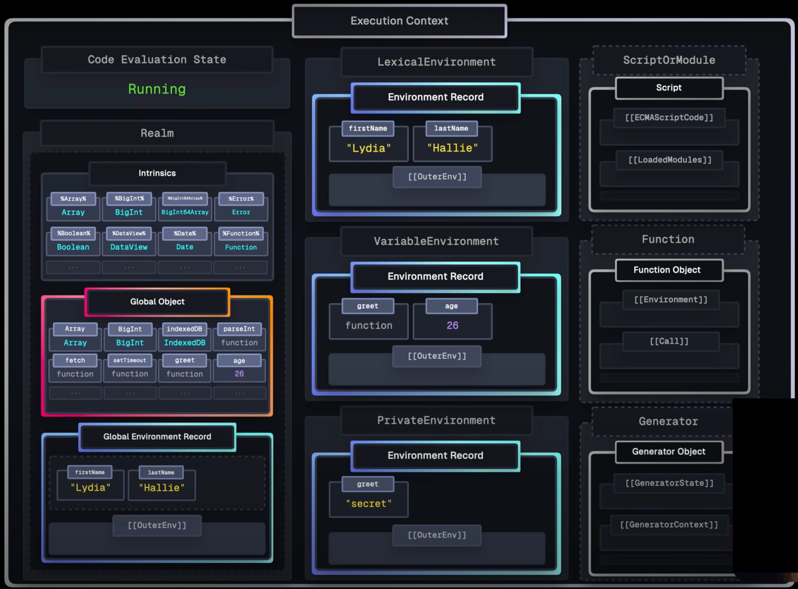

Let's use this script as an example and see what happens behind the scenes whenever we run this script.

```typescript
const firstName = 'Lydia';
let lastName = 'Hallie';

function greet(nameToGreet) {
  const fullName = nameToGreet + ' ' + lastName;
  return 'Hello, ' + fullName;
}

greet(firstName);
```

So first, as the script is loaded, the `global execution context` is created, And every execution context goes through **2 phases**.

- 1st, we have the **`creation phase`** in which memory space is set up for the _variable declarations_, _function declarations_, and so on within that context.

  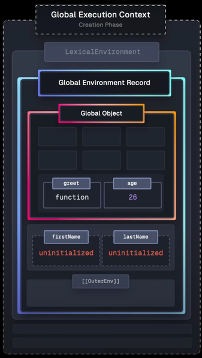

- And then we have the **`execution phase`** in which the execution context is on the call stack and the code is actually executed.

  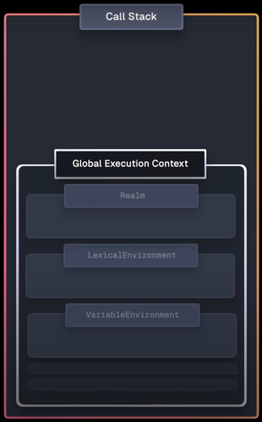

The global execution context has many components, but for now, lets focus on the `realm`, the `lexical environment`, and also the `variable environment` just to make it complete.

## Realm

- The `Realm` points to a realm record, and a realm is essentially an **isolated environment** in which our code runs. So, for example, in browsers, a new realm is created whenever we open a _new tab_, we _refresh a page_, _service workers_, _web workers_, _iFrames_, and so on. So it's essentially just the isolated environment.

  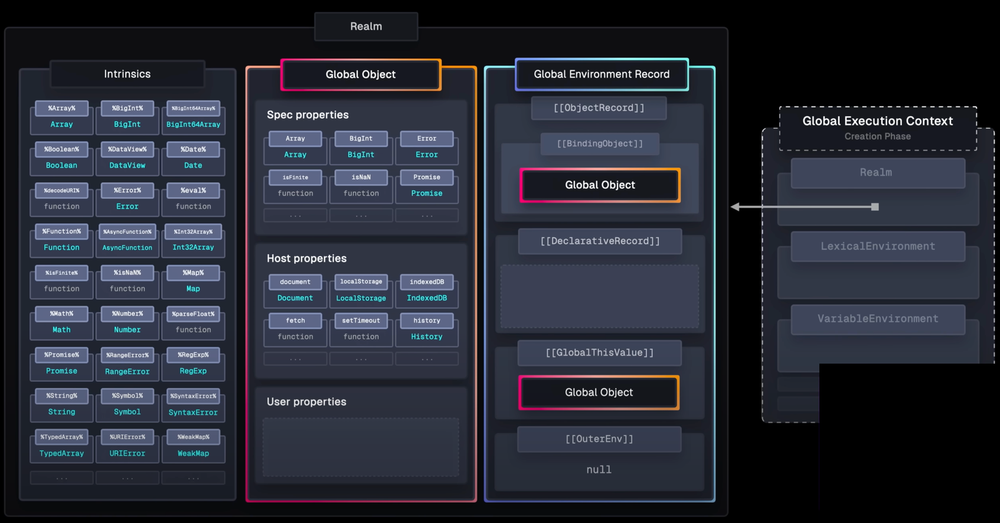

And a realm consists of several components, including the `Intrinsics`, the `Global object`, and the `Global environment record`.

### Intrinsics

The **`Intrinsics`** provide all the standard built in _`objects`_ and _`functions`_ that are essentially just foundational for executing JavaScript, so like _`array`_, _`function`_, _`syntax error`_, and so on.

### Global Object

Then we have the **`Global object`**, which contains several types of properties.

- So first, we have the **`Specification defined properties`** (_JavaScript functionality_), which essentially just expose the _intrinsics_. So _`array`_ _`function`_, all the **JavaScript stuff** is on the _Global object_.
- And then we have the **`Host defined properties`** (_Browser APIs_), which in a browser is things like `fetch`, `setTimeout`, `Document`. That's also all made available through the _Global object_.
- And last but not least, we have the **`User defined properties`**. So as developers, we can either explicitly add properties to the _Global object_ or we do it implicitly whenever we declare a _`function`_ in the global scope or whenever we have a variable with a _`var`_ keyword in the global scope. These are also added to the _Global object_ and are now available, ready to use throughout the entire script.

### Global Environment Record

And lastly, we have the **`Global environment record`**.
And, again, `Environment records` manage the _identifier bindings_ within that context. So in the case of the _Global environment record_, these values are accessible throughout our entire script.

#### Object Record

- And the _Global environment record_ again contains another `Object record`. So the object record is essentially just a **direct reference** to the _global object_.
- So this is used by variables with the _`var`_ keyword and _`function declarations`_ on the global scope.
  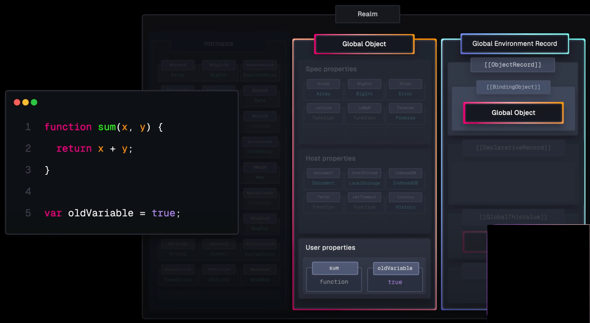

#### Declarative Record

- It also contains a `Declarative record`, and this stores all _identifier bindings_ that _**aren't** variables with the `var` keyword or `function declaration`_. So everything except for those two: (`let`, `const`,`class`, etc.).
  

#### Global `This` Value

- And environment records also contain the value of the `this` keyword, which in the case of the _Global environment record_ is the global `this` value. And in most cases, `this` just points to the _Global object_.

#### Outer Environment Reference

- And finally, it also has an outer env or `Outer environment` property. And in the case of the _Global environment record_, this is **null**.
- But later, we will see why this is a very important property when we talk about _`scope`_, _`scope chain`_, and so on.

## Lexical Environment Record

And the `Lexical environment` just points to the environment record that contains the bindings for _everything **except**_ for variables with the _`var` keyword_ and _`function declarations`_ like variables declared with `let`, `const`, `classes` etc. So in this case, that is the _Global environment record_.

The _Lexical environment record_ contains key information about the _function's scope_, including:

## Variable Environment Record

And then we have the `Variable environment`, and this points to the environment record that stores the bindings for the variables declared with the _`var` keyword_ and _`function declarations`_, which in this case also is the _Global environment record_.

## Script walk-through

So, finally, let's take a look at our script.

```typescript
const firstName = 'Lydia';
let lastName = 'Hallie';

function greet(nameToGreet) {
  const fullName = nameToGreet + ' ' + lastName;
  return 'Hello, ' + fullName;
}

greet(firstName);
```

### Creation phase

- So when parsing this code in the **creation phase**, it first encounters the variable `firstName`, and this is declared with the `const` keyword. So it uses the execution context **Lexical environment**, and this in turn points to the _Global environment record_.

- And this again uses the **Declarative record** to handle the _identifier bindings_ created with the `const` keyword.

  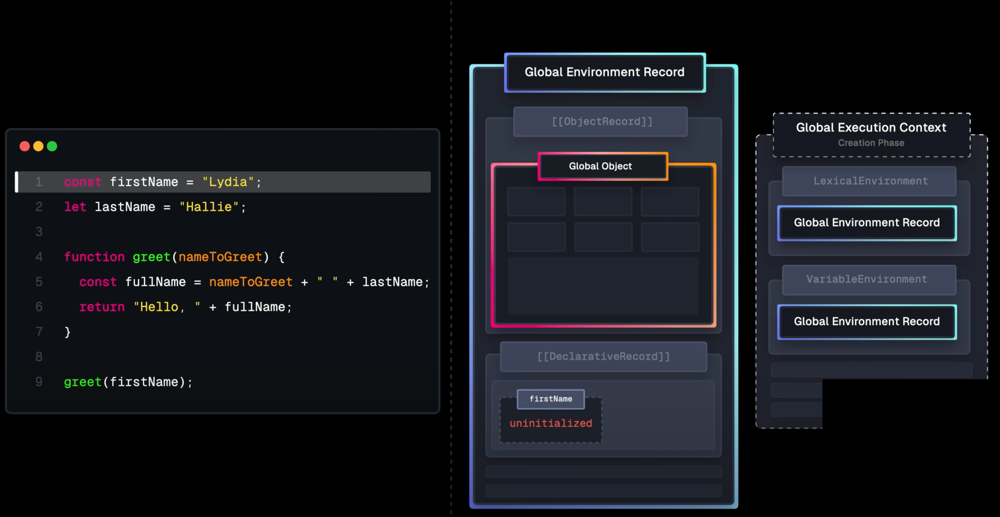

  > And something and special about variables created with the `const` and `let` keyword, and also `classes`, is that they are _uninitialized_.
  > Meaning that memory space is set up, they're **hoisted**, but they don't have a value yet. They are _uninitialized_. They're only initialized during the **execution phase** of the _execution context_.

- So then on line 2, pretty similar. We have the `lastName` variable, and this time, we use the `let` keyword. So it again uses the _Lexical environment_, which points to the _Global environment record_, which again uses the _Declarative record_ to store this binding. And similar to `const`, it is uninitialized until the **execution phase**.

- And then we have the _function_ `greet`, and `function declarations` are managed by the **Object record**. And in contrast to the two previous variables, _functions are initialized during the creation phase_.
  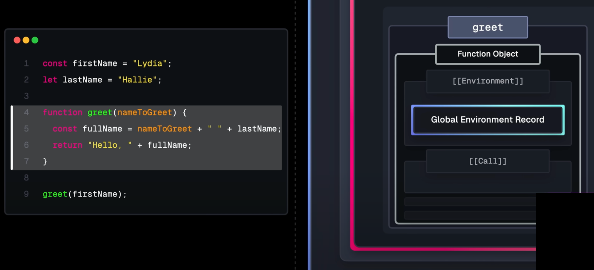
  So a new **Function object** is created for `greet`.
- And _function objects_ contain many properties, two of which are the _`Environment`_, which points to the environment record in which the function was declared. So in this case, the _Global environment record_.
- And it also has the _`Call`_ method, which gets called whenever we invoke the function.

### Execution phase

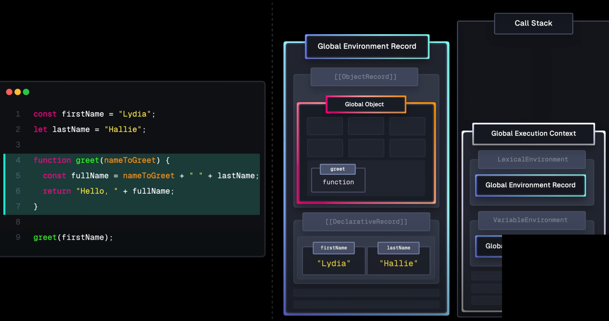

- So now the _Global execution context_ is added to the `call stack` and is executed.
- So, again, on the first line, we have the `firstName` variable. So now this variable gets initialized with the value of the string 'Lydia'. And then on the second line, we have the `lastName` variable. So similar to the first one, it now gets initialized with the string, 'Hallie'.

- And then we have the `greet` _function_, but this is already initialized in memory so nothing gets done here. Then on line 9, we actually invoke this function.
- So the `Call` method on the _function object_ is called, and this, in turn, creates a new _Function execution context_. And you may have guessed, again, **this execution context goes through two phases**. So the _creation phase_ and the _execution phase_.
  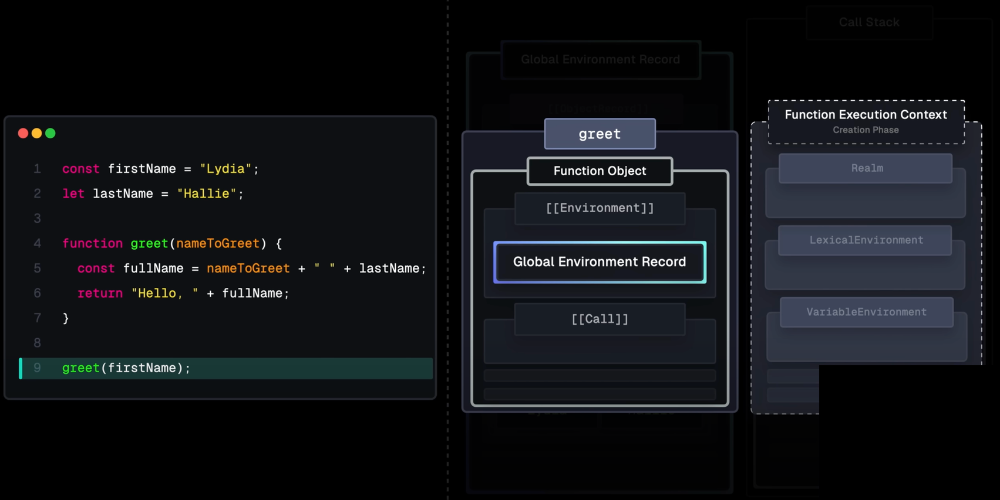

#### Function Execution Context Creation Phase

- So, in this case, the _Lexical environment_ contains a brand new _Function environment record_, and this manages the _identifier bindings_ for the parameters, variables, and function declarations within this function.

- And it also has an `OuterEnv` property. Again, the _outer environment_, which points to the environment of the _Function object_, which, in this case, is the _Global environment record_. And unlike the _Global execution context_, we now have to deal with function parameters. So in this case, `nameToGreet`.
  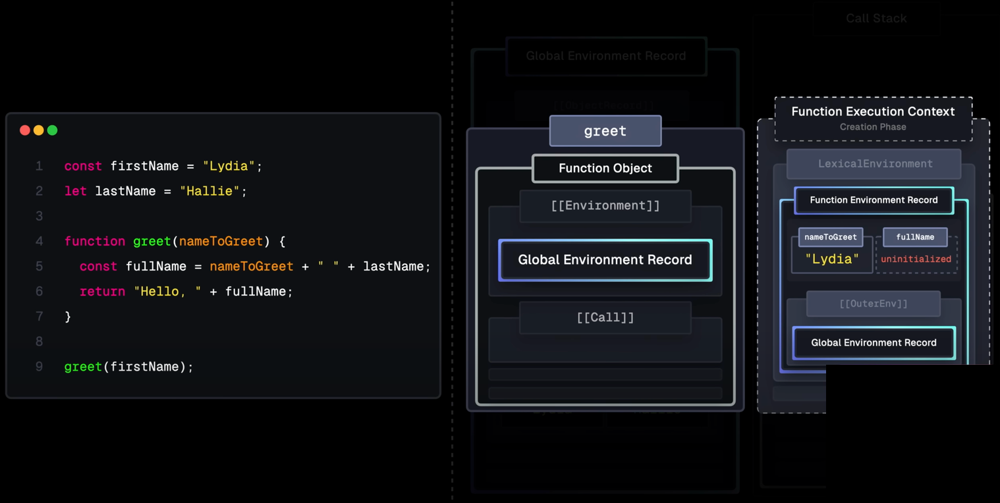

- And these are immediately added to the _Function environment record_, and, also, these are immediately initialized with the value that we pass. So in this case, the string 'Lydia'.
- Next, we declare the `fullName` with the `const` keyword. And this is also added to the _Function environment record_, but it is uninitialized until we get to the _execution phase_. So now that we've allocated memory for the parameters and the variables, it's time for the _execution phase_.

#### Function Execution Context Execution Phase

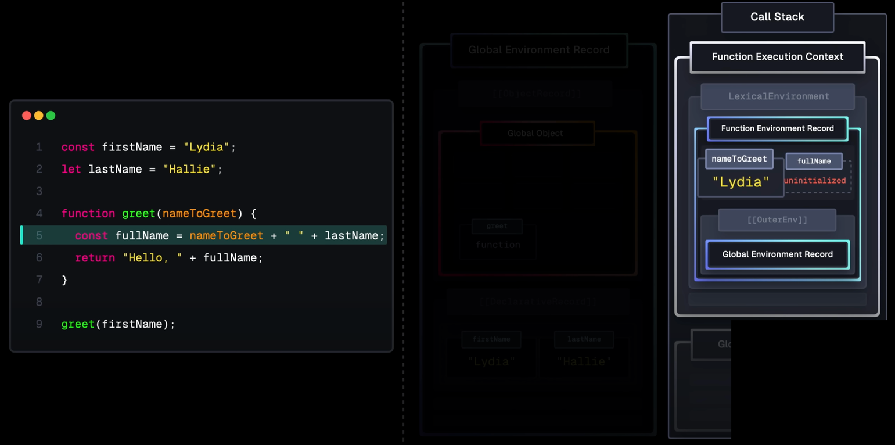

- So the _Function execution context_ is added onto the `call stack`. So first, we have the `fullName` variable, and this uses both the `nameToGreet` parameter value, but also the `lastName` variable.
- Now the _Function environment record_ itself doesn't have a binding for `lastName`.
- So instead, it uses the `OuterEnv` property on the _Environment record_ to search through the chain of environments, the _scope chain_, to see if the _outer environment_ does have the binding for this. So in this case, that is the _Global environment record_, and, yes, this one does have `lastName`, which is 'Hallie'.
  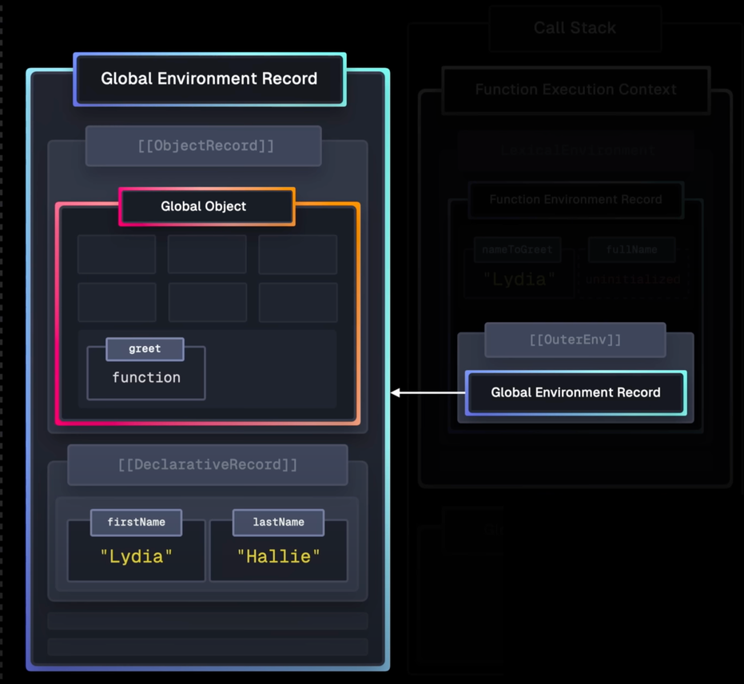

- So now `fullName` is equal to the string 'Lydia Hallie', and then the function returns 'Hello, Lydia Hallie'.
  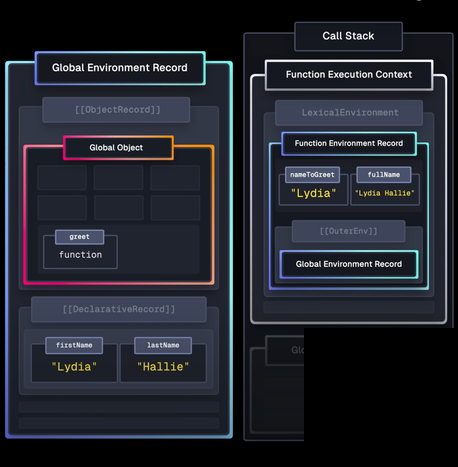
  And as it returns, the _Function execution context_ is removed from the `call stack`. And the topmost _execution context_ is the currently running _execution context_, which is, again, the global one.
- Now there is nothing else to do in our script. So now also the _Global execution context_ is removed from the `call stack`, which is the end of our script.

## Understanding Variable Hoisting

- Hoisting happens during the _creation phase_ of an _execution context_ and variables declared with `let`, `const`, `classes` and `imports` are _**hoisted**_ to the top of their scope. However, this does not mean they are initialized at this point; rather, a reference to them is created in the _Lexical environment record_.

- Imagine the following code:

  ```javascript
  console.log(x); // ReferenceError: x is not defined

  let x = 10;
  ```

In this example, the `x` variable is declared at the end of the script. However, when we try to log its value, a `ReferenceError` is thrown because it has not been initialized yet. They're only initialized during the _execution phase_ when their actual declaration is reached in the code.

### Temporal Dead Zone

- Variables that are declared with `const` or `let` within an inner function are placed in a **temporary dead zone** until they are actually assigned a value. Accessing these variables before their declaration
  will result in a `ReferenceError`.

  `Temporal Dead Zone Example`

  ```javascript
  function outer() {
    console.log(x); // ReferenceError: x is not defined
    const x = 10; // In the temporal dead zone
  }

  outer();
  ```

- In this example, we declare `x` as a constant within an inner function. Because it's in the _temporal dead zone_, trying to access its value before assignment will result in a `ReferenceError`.

### Hoisting for `var`

- Then we have variables with the `var` keyword. And during the _creation phase_ of the _execution context_, these are also _hoisted_ and _initialized_, but with the value of `undefined`. And these variables get redefined with their actual values during the _execution phase_ whenever their declaration is reached within the code.

  ```javascript
  console.log(foo); // undefined
  var foo = 'Hello!';
  console.log(foo); // 'Hello!'
  ```

### Function Hoisting

- And lastly, we have `functions`, including `async`, `generator` functions and so on.
  Functions are already initialized during the _creation phase_ with their actual _Function object_. This means that functions can be invoked before their declaration because the function object is already in memory.

  ```javascript
  console.log(add(10, 20)); // 30

  function add(a, b) {
    return a + b;
  }
  ```

In this example, we try to call the `add` function before it's declared. Because functions are hoisted, they become part of the global scope and can be invoked immediately.

## **Closures**

- A `closure` is created when an inner function keeps a reference to the outer function's _environment record_. This means that the inner function has access to the variables in the outer function's scope even after the outer function has returned and this is made possible through the _Function object's_ _environment property_.

- Creating a _closure_ example:

  ```javascript
  const firstName = 'Lydia';

  function outer() {
    const lastName = 'Hallie';

    function inner() {
      const fullName = firstName + ' ' + lastName;
      return fullName;
    }

    return inner;
  }

  const getFullName = outer();
  getFullName(); // Lydia Hallie
  ```

- In this example, when we invoke `getFullName` , a new _Function execution context_ is created that has a brand new function _environment record_. And this function environment record's `OuterEnv` property points to the environment property on the _Function object_, which in this case is the `outer` function's _Environment record_.

  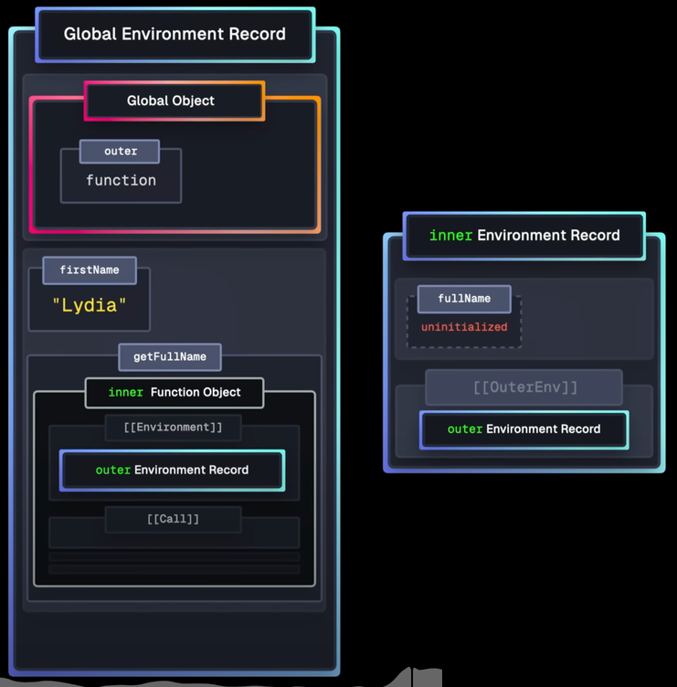

- So within `inner`, we still have access to the `lastName` variable.
  So it'll traverse the _scope chain_ and `OuterEnv` pointing to the `outer` functions _environment record_, which contains a binding for `lastName`.

  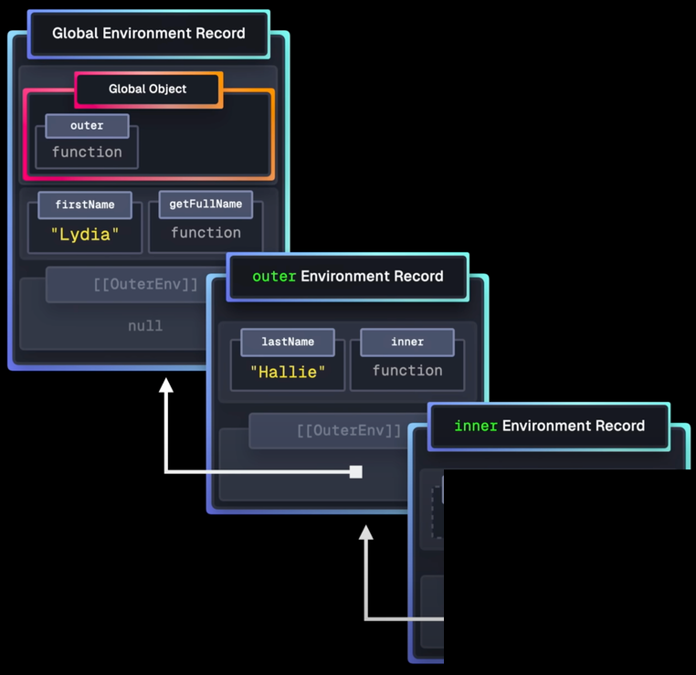

### Understanding Scope Chain

- The engine traverses the `scope chain` (`OuterEnv` properties) to find a binding for a variable or property not found in the current context's _Lexical environment record_.
  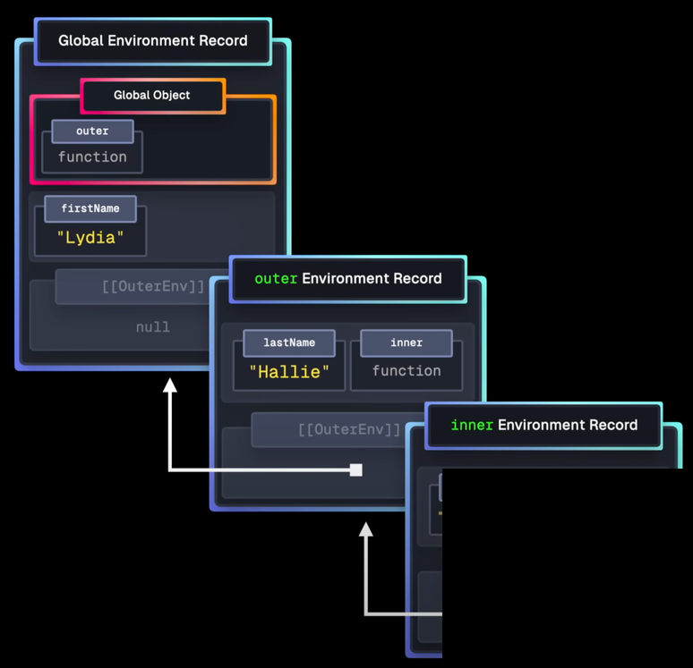

- _Scope chain_ example:

  ```javascript
  const firstName = 'Lydia';
  
  function outer() {
    const lastName = 'Hallie';
  
    function inner() {
      const fullName = firstName + ' ' + lastName;
      return fullName;
    }
  
    return inner();
  }
  
  outer();
  ```
  
  In this case, the `firstName` variable is found in the _Global scope_ and the `lastName` variable is found in the `outer` function's _Lexical environment record_. The engine uses the _scope chain_ to access these variables when executing the `inner` function.
